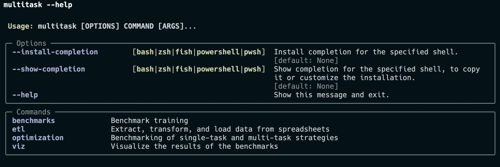

# Multitask 
[](https://wandb.ai/ceb-sre/multitask/)


Optimizing reactions using multitask Bayesian optimization. Based on the paper [Accelerated Chemical Reaction Optimization Using Multi-Task Learning](https://doi.org/10.1021/acscentsci.3c00050).

## Setup

Clone the project:

    git clone https://github.com/sustainable-processes/multitask.git

Install [poetry](https://python-poetry.org/docs/) and then run the following command to install dependencies:

    poetry install

Additionally, until this [issue](https://github.com/open-reaction-database/ord-schema/issues/600) is fixed, you will need to manually install the ord-schema dependencies:
    
    poetry run pip install -r ord-requirements.txt

You can run commands from inside the poetry virtual environment in one of two ways:

  - **Option 1**: Put `poetry run` in front of every command (e.g., `poetry run dvc repro`) as we did above to install extra requirements.
  - **Option 2**: Activate the virtual environement and run everything as normal:
      - Run `poetry show -v`. Copy the path specified after "Using virtualenv"
      - Activate the virtual environemnt at that path. So, if the path is `/Users/Kobi/Library/Caches/pypoetry/virtualenvs/multitask-z7ErTcQa-py3.7`, you would run `source /Users/Kobi/Library/Caches/pypoetry/virtualenvs/multitask-z7ErTcQa-py3.7/bin/activate`
  

_Apple M1_

You might run into some issues when installing scientific python packages such as Summit on Apple M1. Follow the steps below to install via pip:

```bash
arch -arm64 brew install llvm@11 
brew install hdf5
HDF5_DIR=/opt/homebrew/opt/hdf5 PIP_NO_BINARY="h5py" LLVM_CONFIG="/opt/homebrew/Cellar/llvm@11/11.1.0_3/bin/llvm-config" arch -arm64 poetry install
```
Replace the llvm path with the version of llvm installed by brew.

## CLI

There is a `multitask` CLI available. You can see all the commands by running `multitask --help`



## Regnerating the results


1. **ETL**: Transform data from spreadsheets into ORD protobuf files.

    ```bash
    multitask etl all
    ```
2. **Benchmark training and Benchmarking using Lightning**:

    ```bash
    lightning run app  --name multitask --open-ui False --without-server lightning_study.py
    ```
    Some extra flags to add:
    - `--env WANDB_API_KEY=<YOUR_API_KEY>`: Add your weights and biases API key
    - `--cloud`: Run on lightning cloud instead of locally
    - `--env lightning_cloud=True`: Tag these runs as running in the cloud

3. **Generate plots**

    ```bash
    multitask viz all-suzuki --include-tags lightning_cloud --wandb-entity "ceb-sre" 
    ```
    

## Development

Please format your code using [black](https://github.com/psf/black). Jupyter notebooks, which are for exploration, don't need to be formatted.

**Directory Structure**
```
├── data/  # Store all data and results here (tracked mainly by DVC)
├── figures/  # Store figures in this directory and track using dvc
├── multitask # python package with key functionality
├── nbs # Exploratory Jupyter notebooks
├── poetry.lock  # Poetry lock file
└── pyproject.toml # Poetry configuration file
```
* Put final code for pipelines in `multitask`, and add the code to pipelines as described in the previous section.
* [Typer](https://typer.tiangolo.com/tutorial/first-steps/) is great for turning a python function into a command line script. It's already installed, so you might as well use it.

## Citing

If you find this project useful, we encourage you to

* Star this repository :star: 
* Cite our [paper](https://doi.org/10.1021/acscentsci.3c00050).
```
@article{Taylor2023,
  doi = {10.1021/acscentsci.3c00050},
  url = {https://doi.org/10.1021/acscentsci.3c00050},
  year = {2023},
  month = apr,
  publisher = {American Chemical Society ({ACS})},
  volume = {9},
  number = {5},
  pages = {957--968},
  author = {Connor J. Taylor and Kobi C. Felton and Daniel Wigh and Mohammed I. Jeraal and Rachel Grainger and Gianni Chessari and Christopher N. Johnson and Alexei A. Lapkin},
  title = {Accelerated Chemical Reaction Optimization Using Multi-Task Learning},
  journal = {{ACS} Central Science}
}
```